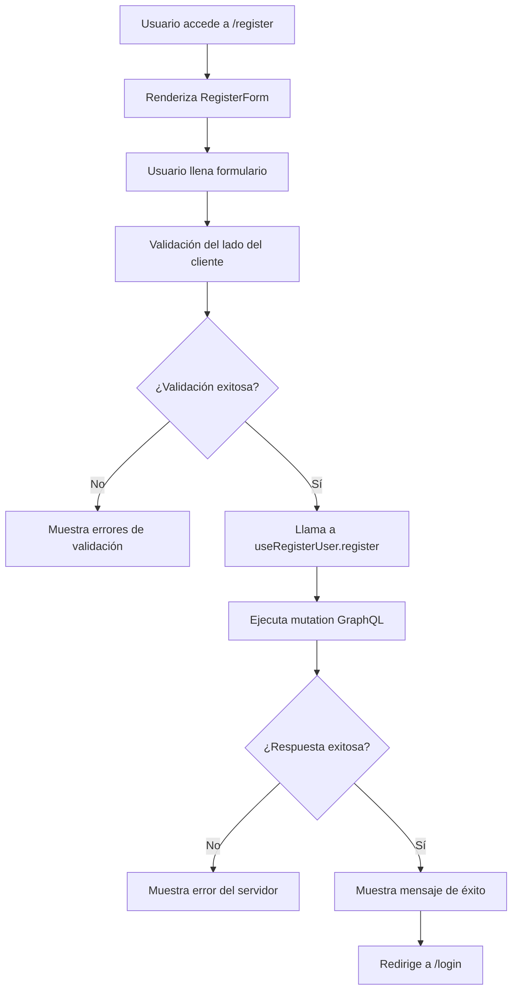

# Sistema de Autenticación - Happy Baby Style Web Admin

## Descripción General

Este módulo implementa un sistema completo de autenticación siguiendo los principios SOLID y Clean Architecture, incluyendo funcionalidades de login, registro y gestión de usuarios.

## Componentes Implementados

### 1. **RegisterForm** (`RegisterForm.tsx`)
- **Responsabilidad**: Formulario de registro de usuarios
- **Características**:
  - Validación del lado del cliente
  - Selección de roles (Cliente, Staff)
  - Validación de contraseñas
  - Manejo de errores del servidor
  - Estados de carga y éxito

### 2. **RegisterModal** (`RegisterModal.tsx`)
- **Responsabilidad**: Modal reutilizable para registro
- **Características**:
  - Diseño consistente con otros modales
  - Callback de éxito configurable
  - Responsive design

### 3. **LoginForm** (`LoginForm.tsx`)
- **Responsabilidad**: Formulario de inicio de sesión
- **Características**:
  - Enlace al registro
  - Recuperación de contraseña
  - Validación de credenciales

## Hooks Implementados

### 1. **useRegisterUser** (`useRegisterUser.ts`)
- **Responsabilidad**: Lógica de negocio para registro
- **Características**:
  - Validación de entrada
  - Manejo de errores GraphQL
  - Integración con Apollo Client
  - Notificaciones toast

### 2. **useUnifiedAuth** (`useUnifiedAuth.ts`)
- **Responsabilidad**: Estado global de autenticación
- **Características**:
  - Método de registro integrado
  - Gestión de tokens
  - Control de acceso basado en roles

## Servicios Implementados

### 1. **UnifiedAuthService** (`UnifiedAuthService.ts`)
- **Responsabilidad**: Lógica de autenticación unificada
- **Características**:
  - Método `register()` implementado
  - Manejo de tokens JWT
  - Mapeo de respuestas GraphQL

## Páginas Implementadas

### 1. **Register** (`Register.tsx`)
- **Responsabilidad**: Página independiente de registro
- **Características**:
  - Redirección post-registro
  - Integración con el contexto de autenticación
  - Diseño consistente con Login

## Flujo de Registro



## Validaciones Implementadas

### Validaciones del Cliente
- **Email**: Formato válido y requerido
- **Contraseña**: Mínimo 8 caracteres
- **Confirmación**: Las contraseñas deben coincidir
- **Nombre y Apellido**: Campos requeridos
- **Rol**: Selección obligatoria

### Validaciones del Servidor
- **Email único**: No puede existir otro usuario con el mismo email
- **Contraseña segura**: Validación de complejidad
- **Datos de perfil**: Validación de formato y longitud

## Manejo de Errores

### Tipos de Errores
1. **Errores de Validación**: Campos requeridos, formatos inválidos
2. **Errores del Servidor**: Email duplicado, problemas de base de datos
3. **Errores de Red**: Problemas de conectividad, timeouts

### Estrategias de Manejo
- **Validación Proactiva**: Errores se muestran en tiempo real
- **Mensajes Contextuales**: Errores específicos para cada campo
- **Recuperación Graceful**: El formulario mantiene el estado en caso de error

## Testing

### Cobertura de Tests
- **useRegisterUser**: Tests unitarios para lógica de negocio
- **RegisterForm**: Tests de integración para UI y validaciones
- **Mocks GraphQL**: Simulación de respuestas del servidor

### Ejecución de Tests
```bash
# Ejecutar tests de autenticación
npm test -- --testPathPattern=auth

# Ejecutar tests específicos
npm test -- useRegisterUser.test.ts
npm test -- RegisterForm.test.ts
```

## Integración con el Sistema

### Dependencias
- **Apollo Client**: Cliente GraphQL
- **React Router**: Navegación entre páginas
- **Styled Components**: Estilos y temas
- **React Hook Form**: Gestión de formularios (futuro)

### Contexto de Autenticación
- **AuthContext**: Estado global de autenticación
- **Protected Routes**: Rutas protegidas por autenticación
- **Role-based Access**: Control de acceso basado en roles

## Estándares de Calidad

### Principios SOLID
- **Single Responsibility**: Cada componente tiene una responsabilidad única
- **Open/Closed**: Extensible para nuevas funcionalidades
- **Liskov Substitution**: Comportamiento consistente entre implementaciones
- **Interface Segregation**: Interfaces específicas para cada uso
- **Dependency Inversion**: Dependencias de abstracciones, no implementaciones

### Clean Architecture
- **Separación de Capas**: UI, lógica de negocio y datos separados
- **Inversión de Dependencias**: Hooks dependen de servicios, no de implementaciones
- **Testabilidad**: Componentes fácilmente testables

### Manejo de Errores
- **Consistencia**: Patrón uniforme de manejo de errores
- **UX**: Mensajes claros y accionables
- **Logging**: Registro de errores para debugging

## Futuras Mejoras

### Funcionalidades Planificadas
1. **Verificación de Email**: Confirmación por email post-registro
2. **Captcha**: Protección contra bots
3. **OAuth Social**: Login con Google, Facebook, etc.
4. **2FA**: Autenticación de dos factores

### Optimizaciones Técnicas
1. **Lazy Loading**: Carga diferida de componentes
2. **Memoización**: Optimización de re-renders
3. **Service Workers**: Funcionalidad offline
4. **PWA**: Progressive Web App features

## Documentación de API

### GraphQL Mutation
```graphql
mutation RegisterUser($input: CreateUserProfileInput!) {
  registerUser(input: $input) {
    success
    message
    code
    timestamp
    data {
      user {
        id
        email
        role
        isActive
        emailVerified
        profile {
          firstName
          lastName
          phone
          dateOfBirth
        }
      }
      accessToken
      refreshToken
    }
    metadata {
      requestId
      traceId
      duration
    }
  }
}
```

### Tipos TypeScript
```typescript
interface CreateUserProfileInput {
  email: string;
  password: string;
  role: UserRole;
  isActive: boolean;
  firstName: string;
  lastName: string;
  phone?: string;
  dateOfBirth?: string | null;
}

interface AuthResponse {
  success: boolean;
  user: IAuthUser;
  tokens: IAuthToken;
  message: string;
  code: string;
  timestamp: string;
  metadata?: AuthMetadata;
}
```

## Contribución

### Guías de Desarrollo
1. **Seguir principios SOLID** en todas las implementaciones
2. **Mantener consistencia** con patrones existentes
3. **Agregar tests** para nuevas funcionalidades
4. **Documentar cambios** en este README

### Proceso de Review
1. **Code Review**: Mínimo 2 aprobaciones
2. **Tests**: Todos los tests deben pasar
3. **Linting**: Sin errores de ESLint
4. **Documentación**: README actualizado

---

**Última actualización**: Enero 2025
**Versión**: 1.0.0
**Mantenido por**: Equipo de Desarrollo
